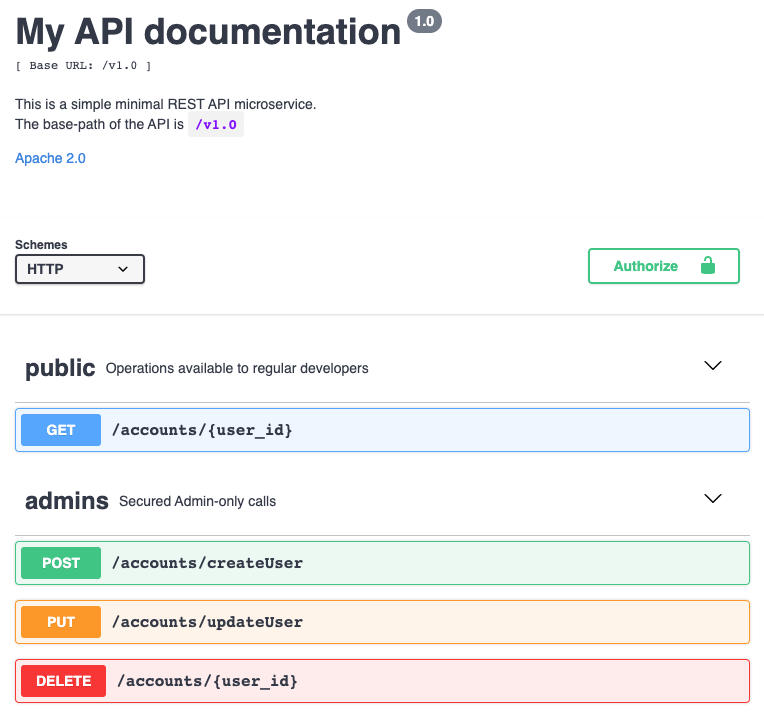

# Minimal REST API Microservice

This repository contains a simple minimal REST microservice boilerplate written in python using Flask. 
It is meant to be a boilerplate/template to clone and quickly start a scalable microservice application.

The service implements an API that maps RESTful calls to a mongoDB database. It implements read, create, delete, update of accounts records 
in mongoDB, but you can pass in input any JSON file you want to insert
into the database (only the field `id` is mandatory). The REST API is created using [Flask](https://github.com/pallets/flask), 
[Flask-Injector](https://pypi.python.org/pypi/Flask-Injector) and [Connexion](https://github.com/zalando/connexion).
Connexion is a python library to use [OpenAPI](https://swagger.io/specification/), formerly Swagger, to describe and document RESTful APIs
using a design-first approach.




Project Organization
------------

    |
    ├── /account-microservice
    │   ├── /api       
    |   |   ├── __init__.py                         <- Python init file
    |   |   └── accounts.py                         <- Python file where methods are injected in the API
    │   ├── /providers       
    |   |   └── MongoProvider.py                    <- Python file where methods are implemented
    │   ├── /swagger       
    |   |   └── accounts-service-docs.yaml          <- API Swagger file
    │   ├── app.py                                  <- Main python file to run the app
    │   ├── Dockerfile                              <- Dockerfile used to build the image of the microservice
    │   └── requirements.txt                        <- Requirements file with the list of the libraries needed
    │
    ├── /img                                        <- Folder containing the images for this README file
    ├── LICENSE                                     <- License file
    ├── README.md                                   <- This Readme file
    └── docker-compose.yml                          <- Docker compose file, used to run the microservice
     
--------

# Quickstart
## Run the microservice
Run the following command in the root folder of the project (need docker and docker-composed installed).
```
docker-compose up
```

## Consult the API documentation
To consult the API documentation just type the following address in a browser.
```
http://localhost:2020/v1.0/ui/
```

**Endpoints available at `http://localhost:2020/v1.0/{URI}`**:

|Method|URI|Description|
|------|---|-----------|
| GET | /accounts/{user_id} | Retrieve data from the DB given an id |
| POST | /accounts/createUser | Insert data into the DB (Any JSON file, id mandatory)|
| PUT | /accounts/updateUser | Update data in the DB |
| DELETE | /accounts/{user_id} | Delete data from the DB | 

# Customize the microservice

To customize the microservice for your own purpose, you have just to modify:
- `MongoProvider.py` This file contains the implementation of the API methods. In this case it contains the methods to
create, delete, update and read a record from mongoDB. Customize it with your desired implementation.
- `accounts.py`: This file describes the API methods and what implementation should they run.
- `accounts-service-docs.yaml`: This file contains the OpenAPI specification that describe the RESTful API.
Modify this file according to your needs changing paths of the API methods and keeping in mind to modify `parameters`
and `operationId` depending on what you edited in the `accounts.py` file. Consult the official documentation to learn more 
about [OpenAPI](https://swagger.io/specification/v2/).

Run your modified microservice with the command:
```
docker-compose build && docker-compose up
```

# Create new microservices from the boilerplate
To create a new microservice:
- Duplicate the `account-microservice` folder and rename the it `XXXX-microservice`
with the name of your new microservice. Customize your new microservice following the instruction in the previous section.
- Modify the `docker-compose.yml` file duplicating the `account-microservice` specifications and renaming them `XXXX-microservice`.
Keep in mind to modify also the parameters `- PORT=YYYY` and `ports` with your desired exposed port.

Once again, run the microservices with the command:
```
docker-compose build && docker-compose up
```